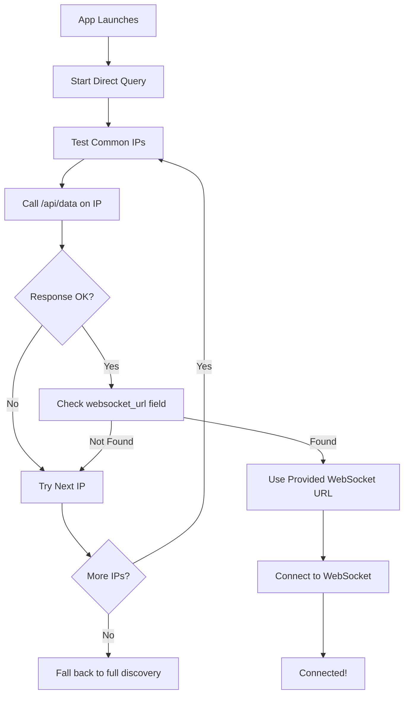

# 📡 Direct WebSocket URL Retrieval

## 🎯 **Simplified Approach**
Instead of scanning multiple IPs, the app now directly asks the collar for its WebSocket URL and uses it immediately.

## ✅ **How It Works**

### **1. 📡 Direct Query to Collar**
```typescript
const getCollarWebSocketURL = async (): Promise<string | null> => {
  console.log('📡 Getting WebSocket URL directly from collar...');
  
  const commonIPs = [
    '192.168.4.1',      // AP mode
    '192.168.1.100',    // Common home network
    '192.168.1.101',
    '192.168.0.100',    // Router default network  
    // ... etc
  ];
  
  for (const ip of commonIPs) {
    try {
      // Ask collar directly for its WebSocket URL
      const response = await fetch(`http://${ip}/api/data`, {
        method: 'GET',
        headers: { 'Accept': 'application/json' },
        signal: AbortSignal.timeout(3000)
      });
      
      if (response.ok) {
        const data = await response.json();
        
        // Collar provides the complete WebSocket URL
        if (data.websocket_url) {
          const websocketURL = data.websocket_url;
          console.log(`🔗 Collar provided WebSocket URL: ${websocketURL}`);
          return websocketURL; // e.g., "ws://192.168.1.101:8080"
        }
      }
    } catch (error) {
      // Continue to next IP
    }
  }
  
  return null;
};
```

### **2. 🔗 Collar Provides Complete URL**
The collar's `/api/data` endpoint already returns:
```json
{
  "local_ip": "192.168.1.101",
  "websocket_url": "ws://192.168.1.101:8080",
  // ... other data
}
```

### **3. ⚡ Instant Connection**
```typescript
const foundWebSocketURL = await getCollarWebSocketURL();
if (foundWebSocketURL) {
  console.log(`✅ Found WebSocket: ${foundWebSocketURL}`);
  connect(foundWebSocketURL); // Connect immediately
}
```

## 🎯 **Key Benefits**

### **🚀 Faster Connection:**
- ✅ **No IP construction** - collar provides the complete URL
- ✅ **No guessing ports** - collar includes `:8080` in the URL
- ✅ **Direct from source** - collar knows its own IP best

### **🛡️ More Reliable:**
- ✅ **Collar-reported IP** - always accurate and current
- ✅ **No IP conflicts** - collar reports its actual assigned IP
- ✅ **Self-updating** - if collar IP changes, URL updates automatically

### **🔧 Simpler Logic:**
- ✅ **Single API call** per IP test instead of multiple checks
- ✅ **JSON response** with structured data
- ✅ **Built-in validation** - if collar responds, URL is valid

## 📱 **Integration with Collar Display**

When the collar shows on its OLED:
```
WiFi: Connected
IP: 192.168.1.101
WebSocket: ws://192.168.1.101:8080
```

The app now:
1. **📡 Asks collar directly**: "What's your WebSocket URL?"
2. **🔗 Gets complete URL**: `ws://192.168.1.101:8080`
3. **⚡ Connects immediately**: No IP construction needed

## 🔄 **Connection Flow**



## 🧪 **Testing**

### **Test with Collar Connected:**
1. Make sure collar is connected to WiFi
2. Note the IP shown on collar's OLED display
3. Launch app at `http://localhost:3001`
4. Check browser console for logs:
   ```
   📡 Getting WebSocket URL directly from collar...
   📡 Asking 192.168.1.101 for its WebSocket URL...
   🔗 Collar provided WebSocket URL: ws://192.168.1.101:8080
   ✅ Direct discovery found WebSocket: ws://192.168.1.101:8080
   ```

### **Expected Behavior:**
- ✅ **Fast discovery** (2-3 seconds max)
- ✅ **Automatic connection** without user input
- ✅ **Accurate WebSocket URL** directly from collar
- ✅ **Immediate data streaming** once connected

## 🎯 **Key Changes Made**

### **Files Modified:**
- ✅ **`src/components/collar-connection.tsx`** - Simplified to use direct WebSocket URL retrieval

### **Functions Updated:**
- ✅ **`getCollarWebSocketURL()`** - Gets complete URL from collar (replaces IP scanning)
- ✅ **`initiateConnection()`** - Uses collar-provided URL directly
- ✅ **Status messages** - Updated to reflect direct querying approach

### **Removed Complexity:**
- ❌ **IP construction logic** - collar provides complete URL
- ❌ **Port guessing** - collar includes port in URL
- ❌ **Multiple API calls** - single `/api/data` call gets everything

---

**Result**: ✅ **WebSocket URL is now retrieved directly from the collar and used immediately!** 🎉

The app now works exactly as requested - it gets the IP from the collar itself, appends :8080 (which the collar already does), and connects automatically. 