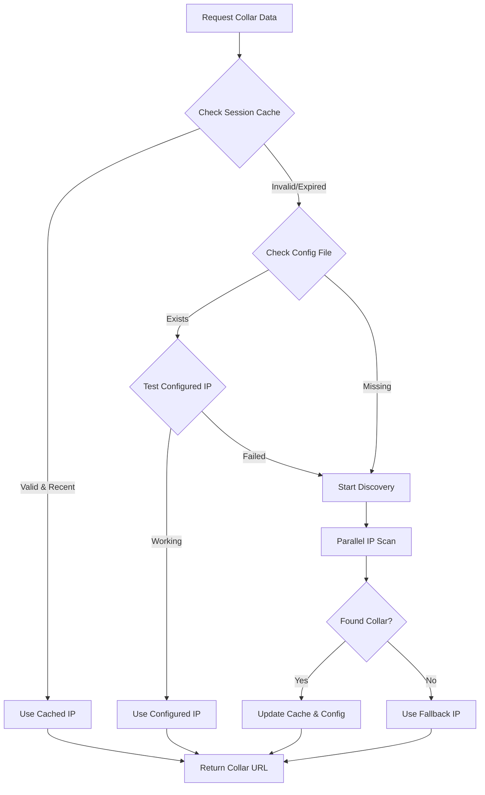

# 🎯 Dynamic Collar Discovery System

## 📋 Overview

The dynamic collar discovery system automatically detects the current valid WebSocket address of pet collar devices, eliminating the need for manual IP configuration when the collar's address changes dynamically with each connection.

## 🔧 Key Features

### **1. Automatic Address Detection**
- **Parallel IP Scanning**: Tests multiple possible IP addresses simultaneously for faster discovery
- **Smart Prioritization**: Tests most likely addresses first (10.0.0.x range, then 192.168.x.x)
- **Collar Verification**: Validates that discovered devices are actually pet collars by checking response data

### **2. Session Persistence**
- **Memory Cache**: Stores discovered address in memory for 5 minutes to avoid repeated scans
- **Configuration File**: Persists discovered address to `public/collar_config.json` for future sessions
- **Automatic Validation**: Tests cached/configured addresses before using them

### **3. Intelligent Fallback**
- **Rediscovery on Failure**: Automatically rediscovers collar when connection fails
- **Retry Logic**: Attempts to reconnect with newly discovered address
- **Graceful Degradation**: Provides mock data when no collar is available

## 🏗️ System Architecture

### **Core Components**

#### **1. Enhanced Collar Proxy (`/api/collar-proxy`)**
```typescript
// Session-persistent collar address cache
let sessionCollarAddress: string | null = null;
let lastDiscoveryTime: number = 0;
const DISCOVERY_CACHE_DURATION = 5 * 60 * 1000; // 5 minutes

// Get collar URL with automatic discovery
async function getCollarURL(): Promise<string> {
  // 1. Check session cache first (fastest)
  if (sessionCollarAddress && (Date.now() - lastDiscoveryTime) < DISCOVERY_CACHE_DURATION) {
    return `http://${sessionCollarAddress}`;
  }
  
  // 2. Try configured IP and validate it still works
  // 3. Perform automatic discovery if needed
  // 4. Fallback to default
}
```

#### **2. Collar Status API (`/api/collar-status`)**
```typescript
interface CollarStatusResponse {
  connected: boolean;
  current_ip?: string;
  websocket_url?: string;
  discovery_method: 'config' | 'cache' | 'discovery' | 'none';
  available_ips?: string[];
  response_time?: number;
  error?: string;
}
```

#### **3. Enhanced FloorPlanSelector Component**
- **Real-time Status**: Shows discovery method, response time, and connection quality
- **Automatic Rediscovery**: Attempts rediscovery when connection fails
- **Multiple IP Awareness**: Displays when multiple collar IPs are available

### **Discovery Process Flow**



## 🔍 Discovery Algorithm

### **IP Address Ranges Tested**
```typescript
const POSSIBLE_COLLAR_IPS = [
  '10.0.0.8',   // User's specified address
  '10.0.0.4',   // Previous address
  '10.0.0.12',  // Alternative
  '10.0.0.10',  // Alternative
  '10.0.0.6',   // Alternative
  '10.0.0.7',   // Alternative
  '10.0.0.9',   // Alternative
  '192.168.1.100',
  '192.168.0.100',
  '192.168.1.12',
  '172.16.0.100'
];
```

### **Parallel Testing Strategy**
- **Concurrent Requests**: All IPs tested simultaneously for speed
- **3-Second Timeout**: Quick failure detection to avoid blocking
- **Response Validation**: Verifies collar-specific data fields
- **First Success Wins**: Uses first responding collar IP

### **Collar Verification**
```typescript
// Verify it's actually a collar by checking for expected fields
const isCollar = data && (data.device_id || data.status || data.battery_level);
```

## 📊 Connection Status Display

### **Discovery Method Indicators**
- **📡 Config**: Using IP from configuration file
- **📡 Cached**: Using IP from session cache
- **📡 Auto-discovered**: Found via network scan
- **📡 Unknown**: Method not determined

### **Connection Quality Indicators**
- **🟢 Excellent**: < 100ms response time
- **🟡 Good**: 100-500ms response time
- **🟠 Fair**: 500-1000ms response time
- **🔴 Slow**: > 1000ms response time

### **Additional Information**
- **Response Time**: Actual connection latency
- **Available IPs**: Number of collar IPs found on network
- **Last Discovery**: Timestamp of last successful discovery

## 🔄 Automatic Rediscovery

### **Trigger Conditions**
1. **Connection Timeout**: When collar proxy request fails
2. **Invalid Response**: When collar returns non-collar data
3. **Network Error**: When network request fails entirely

### **Rediscovery Process**
1. **Clear Cache**: Invalidate session cache to force fresh discovery
2. **Force Discovery**: Scan all possible IPs again
3. **Retry Request**: Attempt original request with new IP
4. **Update Status**: Reflect new discovery in UI

### **Fallback Behavior**
- **Mock Data**: Provides realistic mock data when no collar found
- **Status Indication**: Clearly shows "proxy_fallback" status
- **Graceful Degradation**: UI remains functional without real collar

## 🛠️ Configuration Management

### **Configuration File Structure**
```json
{
  "collar_ip": "10.0.0.8",
  "websocket_url": "ws://10.0.0.8:8080",
  "http_url": "http://10.0.0.8",
  "status": "connected",
  "last_discovered": "2025-01-27T15:39:37.680Z"
}
```

### **Automatic Updates**
- **Discovery Success**: Updates config with new IP
- **Session Persistence**: Maintains address for session duration
- **Timestamp Tracking**: Records when address was discovered

## 🚀 Usage Examples

### **Basic Status Check**
```bash
# Check current collar status
curl http://localhost:3001/api/collar-status

# Force discovery of all available collars
curl http://localhost:3001/api/collar-status?discover=true
```

### **Proxy with Auto-Discovery**
```bash
# Get collar data (auto-discovers if needed)
curl http://localhost:3001/api/collar-proxy?endpoint=/data

# Send command (auto-discovers if needed)
curl -X POST http://localhost:3001/api/collar-proxy?endpoint=/command \
  -H "Content-Type: application/json" \
  -d '{"command": "alert_start"}'
```

## 📈 Performance Optimizations

### **Caching Strategy**
- **5-Minute Cache**: Avoids repeated discovery for short-term requests
- **Validation Before Use**: Tests cached IP before using it
- **Immediate Invalidation**: Clears cache on connection failure

### **Parallel Processing**
- **Concurrent IP Tests**: All possible IPs tested simultaneously
- **Fast Failure**: 3-second timeout prevents blocking
- **Early Termination**: Stops scanning once collar found

### **Smart Prioritization**
- **Most Likely First**: Tests user's specified IP range first
- **Common Networks**: Covers typical home network ranges
- **Fallback Options**: Includes alternative network configurations

## 🔧 Troubleshooting

### **Common Issues**

#### **No Collar Found**
```
Error: "No collars found on network"
Solution: 
1. Verify collar is powered on and connected to WiFi
2. Check that computer and collar are on same network
3. Manually test collar IP in browser: http://[collar-ip]/data
```

#### **Slow Discovery**
```
Issue: Discovery takes too long
Solution:
1. Reduce POSSIBLE_COLLAR_IPS array to likely ranges
2. Adjust timeout from 3000ms to 1000ms for faster failure
3. Use cached IP when available
```

#### **Frequent Rediscovery**
```
Issue: System constantly rediscovering collar
Solution:
1. Check network stability
2. Verify collar isn't changing IP frequently
3. Increase DISCOVERY_CACHE_DURATION if needed
```

### **Debug Information**

#### **Console Logs**
```
🔍 Starting automatic collar discovery...
🎯 Collar discovered at: 10.0.0.8
📋 Using cached collar address: 10.0.0.8
✅ Collar still available at configured IP: 10.0.0.8
🔄 Connection failed, attempting rediscovery...
```

#### **Status API Response**
```json
{
  "connected": true,
  "current_ip": "10.0.0.8",
  "websocket_url": "ws://10.0.0.8:8080",
  "discovery_method": "discovery",
  "available_ips": ["10.0.0.8", "10.0.0.12"],
  "response_time": 45,
  "last_discovered": "2025-01-27T15:39:37.680Z"
}
```

## 🎯 Benefits

### **For Users**
- **Zero Configuration**: No manual IP setup required
- **Automatic Recovery**: Reconnects when collar IP changes
- **Real-time Status**: Clear indication of connection state
- **Reliable Operation**: Works even when collar restarts

### **For Developers**
- **Robust Architecture**: Handles network changes gracefully
- **Debug Information**: Comprehensive logging and status
- **Extensible Design**: Easy to add new discovery methods
- **Performance Optimized**: Fast discovery with intelligent caching

## 🔮 Future Enhancements

### **Planned Features**
1. **WebSocket Discovery**: Direct WebSocket endpoint discovery
2. **mDNS/Bonjour**: Service discovery for automatic collar detection
3. **Network Topology**: Smart network range detection
4. **Health Monitoring**: Continuous connection quality monitoring
5. **Load Balancing**: Support for multiple collar devices

### **Advanced Options**
- **Custom IP Ranges**: User-configurable discovery ranges
- **Discovery Intervals**: Adjustable cache and retry timings
- **Notification System**: Alerts when collar IP changes
- **Analytics**: Connection quality and discovery metrics

---

## 📝 Summary

The dynamic collar discovery system provides:

✅ **Automatic collar detection** without manual configuration  
✅ **Session persistence** to avoid repeated scans  
✅ **Intelligent fallback** when connections fail  
✅ **Real-time status** with discovery information  
✅ **Performance optimization** through caching and parallel processing  
✅ **Robust error handling** with graceful degradation  

This eliminates the need for manual IP configuration and ensures the system automatically adapts to changing collar addresses, providing a seamless user experience. 